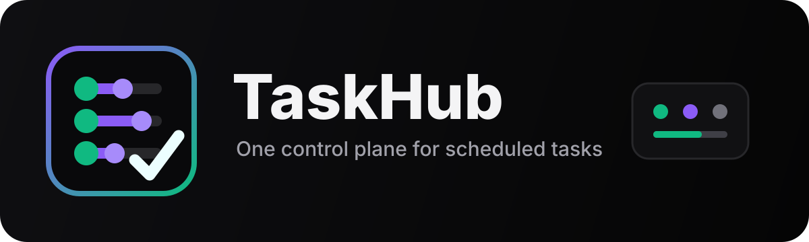
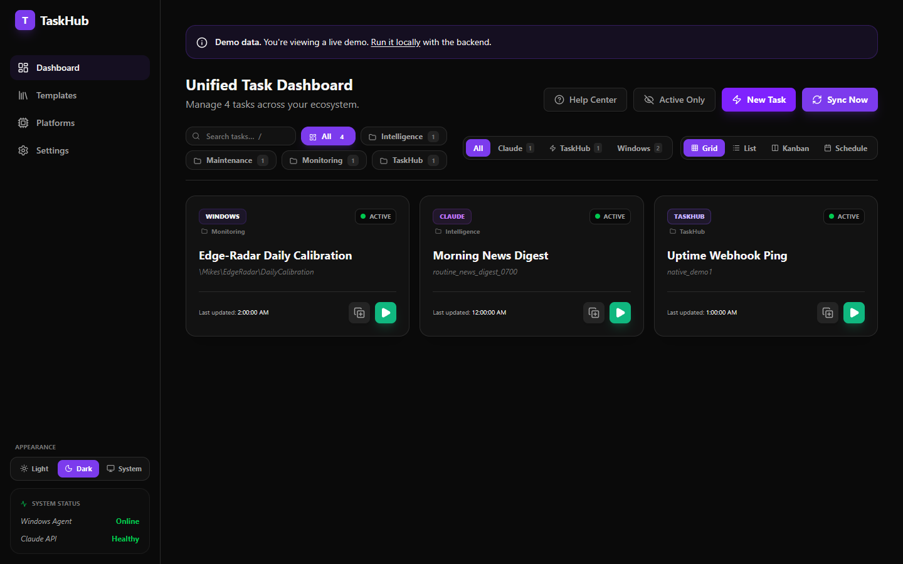
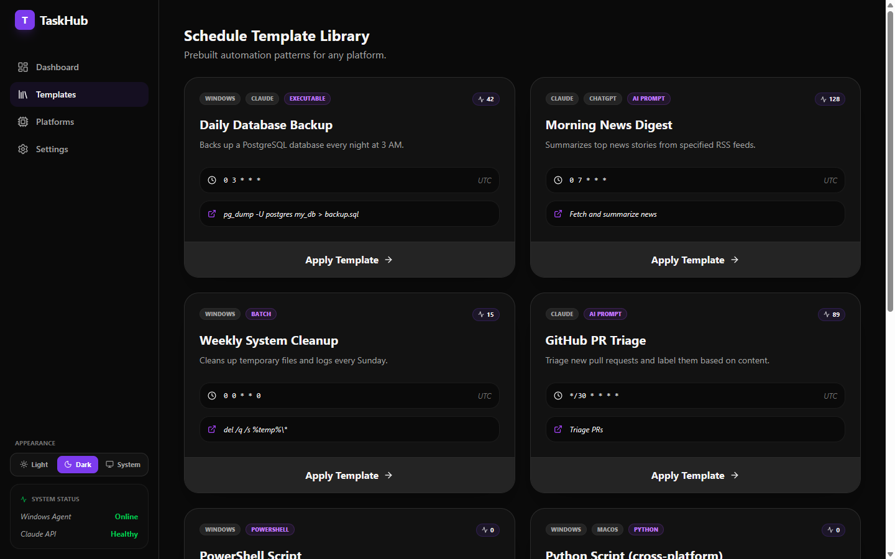
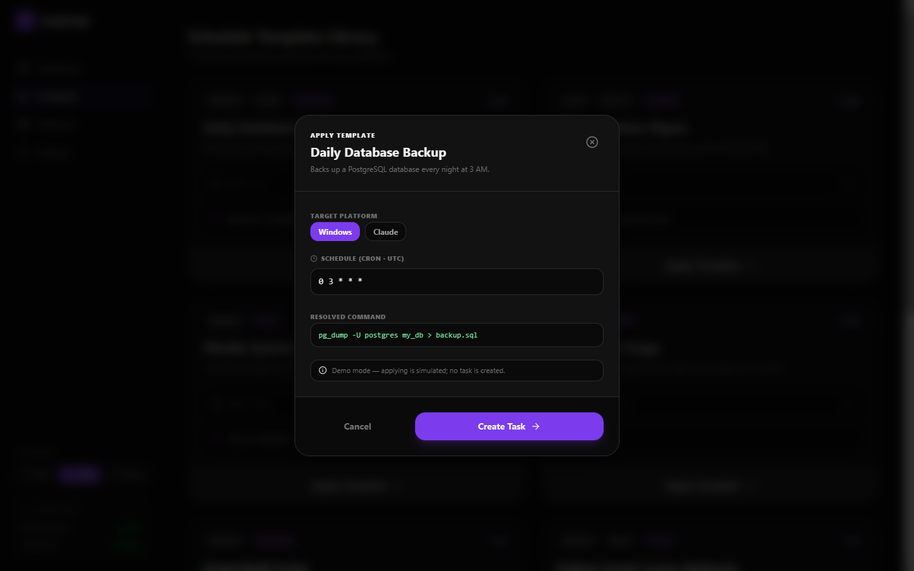
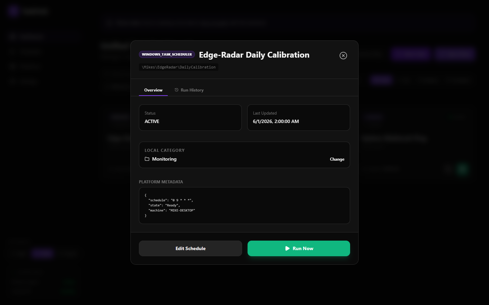
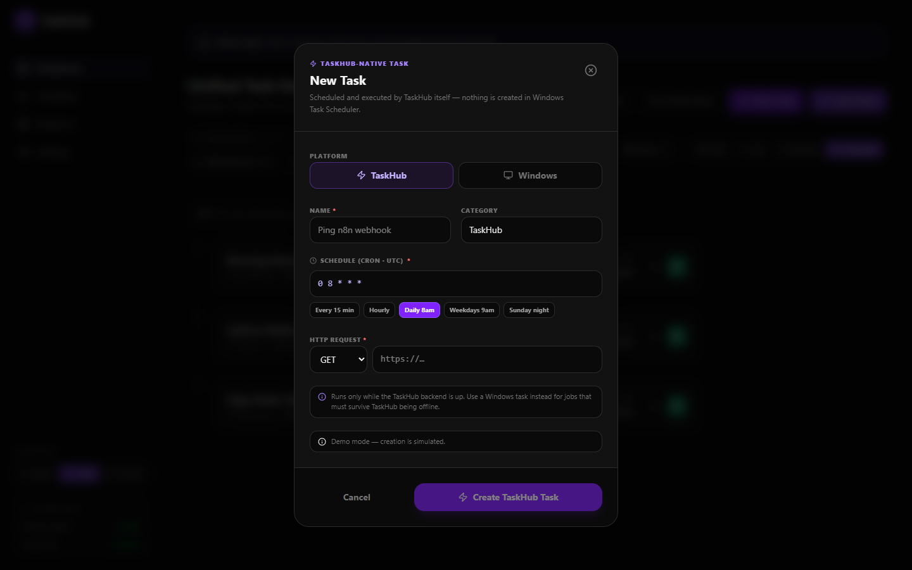
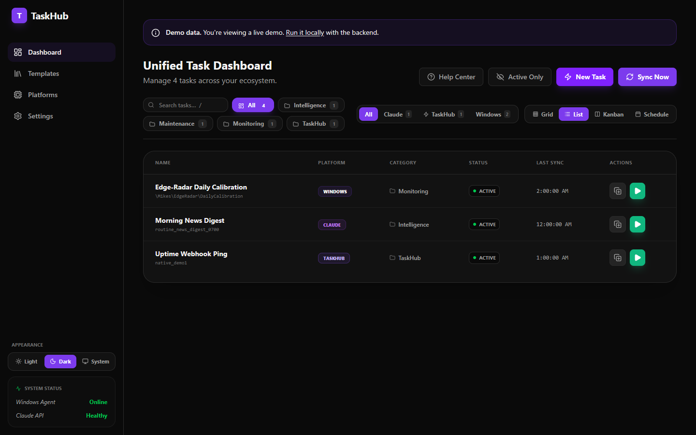
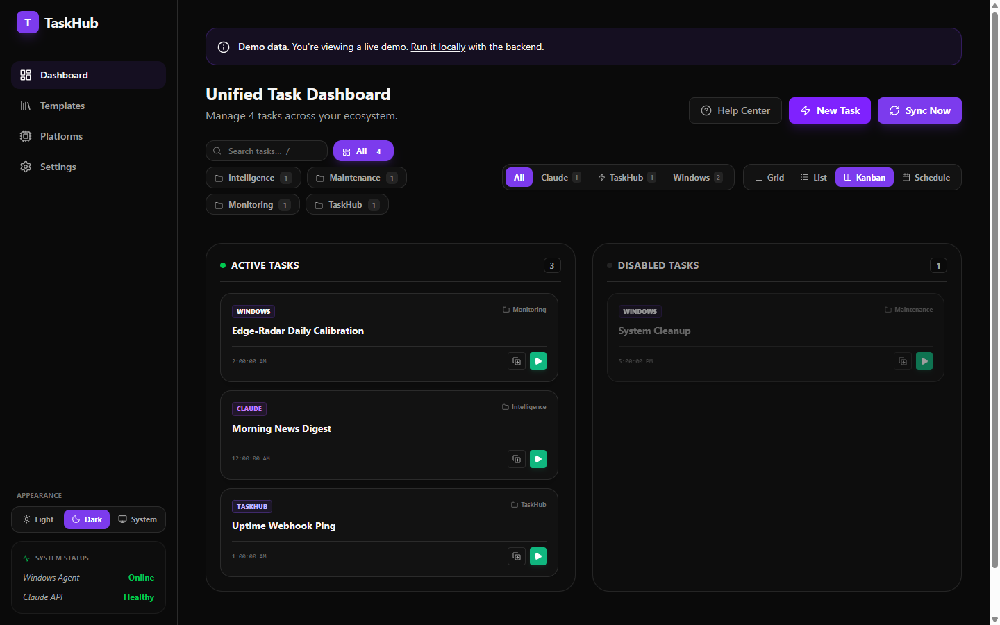
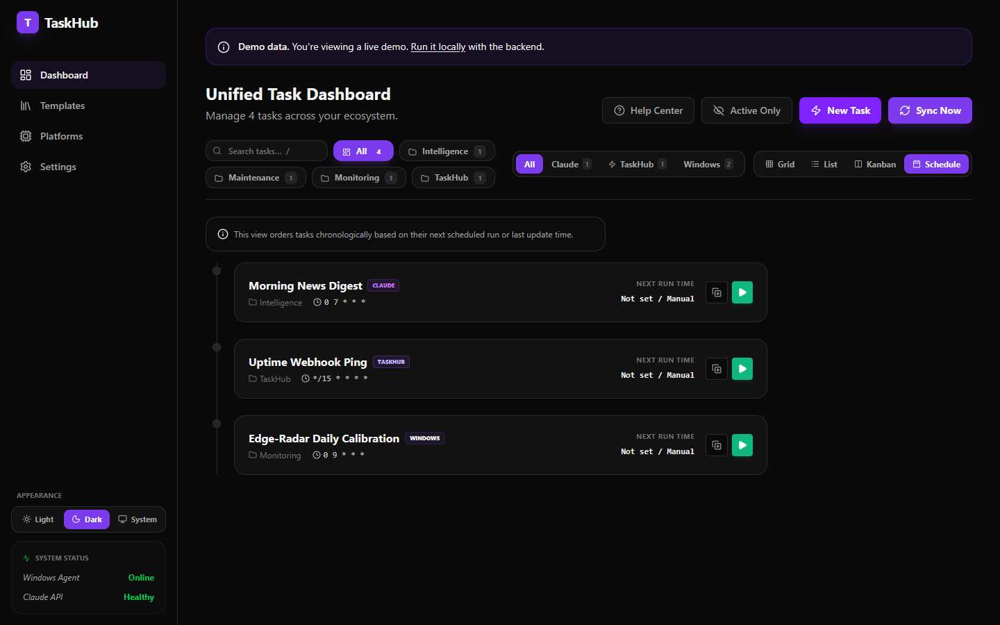
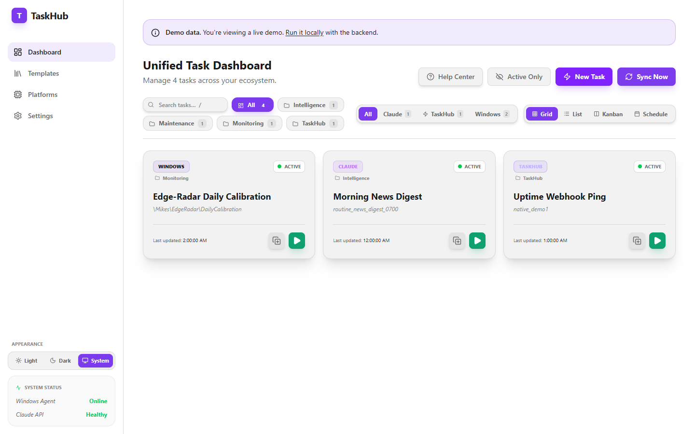

<a id="readme-top"></a>

<p align="center">
  <a href="https://taskhub.mikesailab.com">
    
  </a>
</p>

<p align="center">
  <em>A single pane of glass for every scheduled task you own —<br>Windows Task Scheduler, AI assistants, and cron alike.</em>
</p>

<p align="center">
  <a href="docs/README.md"><strong>Explore the docs »</strong></a>
</p>

<p align="center">
  <a href="https://taskhub.mikesailab.com">View Demo</a>
  ·
  <a href="https://github.com/michaelschecht/taskhub/issues">Report Bug</a>
  ·
  <a href="https://github.com/michaelschecht/taskhub/issues">Request Feature</a>
</p>

<p align="center">
  <a href="https://taskhub.mikesailab.com"></a>
  
  <a href="docs/ROADMAP.md"></a>
</p>

<p align="center">
  
  
  
  
  
  
</p>

---

<details>
<summary><b>📸 Screenshots</b> — dashboard, templates, modals, views, and themes</summary>

<br>

<p align="center">
  
</p>

| | |
|:---:|:---:|
| <br><sub><b>Template library</b> — parameterized script starters</sub> | <br><sub><b>Apply Template</b> — fill in the blanks, get a real task</sub> |
| <br><sub><b>Task detail</b> — metadata, run history, Run Now</sub> | <br><sub><b>New Task</b> — TaskHub-native or Windows, with cron presets</sub> |
| <br><sub><b>List view</b> — sortable columns and quick actions</sub> | <br><sub><b>Kanban view</b> — tasks grouped by status</sub> |
| <br><sub><b>Schedule view</b> — chronological by next run</sub> | <br><sub><b>Light theme</b> — the same dashboard, light variant</sub> |

</details>

## 📌 About

**TaskHub** is a unified scheduled-task manager — one dark-themed dashboard for viewing,
triggering, and managing all the scheduled jobs that today live in disconnected silos.
Instead of jumping between the Windows Task Scheduler MMC, your AI assistant's automation
screens, and a handful of cron files, you see everything in one place and run any of it
with a click — including **from your phone**.

TaskHub connects to:

- **Windows Task Scheduler** — through a lightweight local agent that runs on your machine.
- **TaskHub-native tasks** — HTTP jobs (webhooks, health checks) scheduled and run by TaskHub itself, no OS entry required.
- **Claude Code Routines** — through the Anthropic API *(experimental)*.
- **ChatGPT, Gemini, Jules, and others** — quick links to their native scheduling screens.

> [!NOTE]
> TaskHub is an early **MVP prototype**. The public site is a self-contained demo; the full
> experience (live Windows sync, real triggering) runs locally today. See
> [Quick Start](#-quick-start) for the difference.

**Why it exists:** no existing tool unifies AI-assistant schedulers with your operating
system's scheduler. Desktop utilities are Windows-only or abandoned; heavyweight
orchestrators (Airflow, n8n, Jenkins) are built for data engineers. TaskHub's angle is
cross-domain unification, **mobile-first triggering**, and AI-native task creation.

## 📊 Features

| Capability | What it gives you |
|:---|:---|
| **Unified dashboard** | Every synced task in one view, with platform and status badges, across grid / list / kanban / schedule layouts. |
| **Trigger from anywhere** | Hit **Run Now** on any Windows task from your desk or phone — the request relays down to the agent on your machine. |
| **Live sync** | The local agent keeps TaskHub in step with Windows Task Scheduler automatically, and self-heals if the connection drops. |
| **TaskHub-native tasks** | Create HTTP jobs (webhooks, health checks) that TaskHub schedules and runs itself — no OS task needed. |
| **Template library** | Ready-to-use script starters and use-case patterns; fill in the blanks and TaskHub creates a real scheduled task. |
| **Run history** | Per-task history (status, time, duration, log snippet); failed runs are flagged right on the dashboard. |
| **Search & organize** | Free-text search plus local categories to keep a big task list navigable. |
| **Dark & light themes** | Dark by default, with light and system-follow modes persisted per device. |

## 🔍 How It Works

TaskHub has three pieces. A small **agent** runs on your Windows machine and opens an
outbound connection to the **backend** (it never accepts incoming connections). The agent
pushes your Task Scheduler list up to the backend, which stores it and keeps the **web
dashboard** in sync. When you click **Run Now**, the dashboard tells the backend, and the
backend relays the command back down to the agent — which runs the task locally. Schedules
are normalized to standard cron internally and translated to each platform's native format,
so what you see is consistent no matter where a task actually lives.

> [!IMPORTANT]
> Only the **frontend** is currently hosted (the public demo, where "Run Now" is a no-op).
> The backend and Windows agent run on **your** machine — full setup is in the
> [Installation guide](docs/install/README.md).

<p align="right">(<a href="#readme-top">back to top</a>)</p>

## ⚡ Quick Start

> [!TIP]
> The fastest path is Docker Compose — it brings up the database, backend, and frontend
> together. The Windows agent runs directly on your machine (see step 3).

1. Clone the repo:

   ```bash
   git clone https://github.com/michaelschecht/taskhub.git
   cd taskhub
   ```

2. Bring up the dev stack (Postgres + Redis + backend + frontend):

   ```bash
   docker compose up --build
   #   → frontend  http://localhost:5173
   #   → backend   http://localhost:3000   (GET /api/health to verify)
   ```

3. Start the Windows agent so your real Task Scheduler tasks appear (PowerShell **as Administrator**; must run on the Windows host, not in Docker):

   ```powershell
   cd agent
   Set-ExecutionPolicy Bypass -Scope Process -Force; .\setup-agent-startup.ps1
   ```

4. Open [localhost:5173](http://localhost:5173) — the **Windows Agent** status in the sidebar should read **Online** with your tasks imported.

<details>
<summary><b>Prefer to run each piece manually (no Docker)?</b></summary>

<br>

```bash
# Backend — needs a PostgreSQL 16 instance + DATABASE_URL in backend/.env
cd backend
npm install
npx prisma migrate dev      # create the schema
npm start                   # http://localhost:3000

# Frontend — in a second terminal
cd frontend
npm install
npm run dev                 # http://localhost:5173

# Windows agent — in a third terminal (Windows only)
cd agent/TaskHub.Agent
dotnet run                  # connects out to the backend, pushes Task Scheduler tasks
```

Leave `VITE_DEMO_MODE` unset locally so the dashboard reads live data instead of the demo
fixtures. See [Setup & configuration](docs/setup/README.md) for every option.

</details>

<p align="right">(<a href="#readme-top">back to top</a>)</p>

## 🧱 Built With

| Layer | Technology |
|:---|:---|
| **Frontend** | React 19 + TypeScript + Vite + Tailwind CSS + TanStack Query |
| **Backend** | Node.js + Express 5 + Socket.io (TypeScript) |
| **Database** | PostgreSQL 16 + Prisma 6 ORM |
| **Windows agent** | .NET 10 (`TaskHub.Agent`) reading Windows Task Scheduler |
| **Hosting** | Frontend on Vercel; backend + agent local; dev stack via Docker Compose |

## 📖 Documentation

Full documentation lives in **[`docs/`](docs/README.md)**. The main sections:

| Section | What's inside |
|:---|:---|
| [**📚 Documentation home**](docs/README.md) | The map to every guide, reference, and design doc. |
| [**⬇️ Installation**](docs/install/README.md) | Install TaskHub on Windows or macOS, or clone the repo. |
| [**⚙️ Setup & Configuration**](docs/setup/README.md) | Environment variables, Docker vs. manual, agent pairing. |
| [**🖥️ User Guides**](docs/user-guides/README.md) | Day-to-day guides for using TaskHub once it's running. |
| [**🗺️ Roadmap**](docs/ROADMAP.md) | What's shipped and what's next, in priority order. |

And the key guides, one click away:

| Guide | Takes you through |
|:---|:---|
| [**📦 Clone the Repo**](docs/install/guides/Clone_Repo_Guide.md) | The first step for every install path, plus common prerequisites. |
| [**🪟 Windows Install**](docs/install/guides/Windows_Install_Guide.md) | The full experience — stack, agent, and auto-start at logon. |
| [**🍎 macOS Install**](docs/install/guides/macOS_Install_Guide.md) | Dashboard + backend on macOS (no Windows agent yet). |
| [**🖥️ UI User Guide**](docs/user-guides/guides/UI_User_Guide.md) | Navigating the dashboard, categorizing tasks, applying templates. |
| [**🤖 Windows Agent Setup**](docs/user-guides/guides/Agent_Setup_Guide.md) | Installing, verifying, and troubleshooting the local agent. |

## 🤝 Contributing

TaskHub is a private MVP-stage repository. If you're working on it, start with
[`CONTRIBUTING.md`](CONTRIBUTING.md) and [`CLAUDE.md`](CLAUDE.md), and track work on the
[Roadmap](docs/ROADMAP.md). Recent changes are logged in [`CHANGELOG.md`](CHANGELOG.md).

<p align="right">(<a href="#readme-top">back to top</a>)</p>

---

<p align="center">
  Part of the <a href="https://mikesailab.com">mikesailab.com</a> ecosystem ·
  <a href="https://taskhub.mikesailab.com">Live Demo</a> ·
  <a href="docs/README.md">Documentation</a> ·
  <a href="docs/ROADMAP.md">Roadmap</a>
</p>

<p align="center">
  <sub>© 2026 Michael Schecht · Private repository · All rights reserved</sub>
</p>
