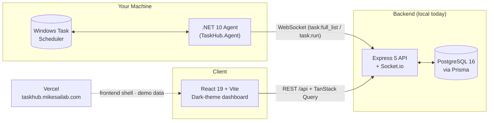

<h1 align="center">TaskHub</h1>

<p align="center">
  <em>One pane of glass for every scheduled task you own — Windows Task Scheduler, AI assistants, and cron alike.</em>
</p>

<p align="center">
  <a href="https://taskhub.mikesailab.com"></a>
  
  
</p>

<p align="center">
  
  
  
  
  
  
  
  
</p>

---

## ✨ Overview

**TaskHub** is a unified scheduled-task management system — a single dark-themed dashboard for viewing, triggering, and managing scheduled tasks that today live in disconnected silos:

- **Windows Task Scheduler** — via a lightweight local .NET agent
- **TaskHub-native tasks** — scheduled and executed by the backend itself (HTTP webhooks, health checks) with no OS entry ([design](docs/resources/Native_Tasks.md))
- **Claude Code Routines** — via the Anthropic API *(experimental)*
- **ChatGPT Automations** — via quick links to the native UI *(planned)*
- **Jules**, **Open Claw**, **Hermes**, and future systems *(planned)*

Beyond unification, the roadmap adds cross-platform schedule conversion templates (cron ↔ Windows trigger ↔ Claude routine YAML) and an **MCP server** so Claude / Codex / Cursor can create and run scheduled tasks via natural language.

### Why it exists

No incumbent unifies AI-assistant schedulers with OS-level schedulers. Desktop tools (VisualCron, Task Till Dawn) are Windows-only or stagnant; web orchestrators (Airflow, n8n, Rundeck, Jenkins) target data engineers and DevOps — the wrong persona for someone who just wants to *manage* the schedules across the tools they already use. Full survey in [`docs/research/Competition_Analysis.md`](docs/research/Competition_Analysis.md). The wedge: **cross-domain unification**, **mobile-first triggering** (phone-trigger a Windows task in under 30s), and **MCP-native** AI task creation.

## 🚀 Live Demo

**[taskhub.mikesailab.com](https://taskhub.mikesailab.com)** runs the dashboard against built-in sample tasks — a stand-in for a real environment so you can explore the UI without any setup.

- The **frontend is hosted on Vercel**; the demo is flagged on via the `VITE_DEMO_MODE` build-time env var.
- "Run Now" is a no-op in demo mode (it explains how to connect a real backend).
- Set TaskHub up locally with the env var **unset**, and the same UI reads live data from your backend + Windows agent instead.

## 🏗️ Architecture



**How sync works today:** the agent opens an **outbound** WebSocket to the backend (never an inbound bind), pushes the full Task Scheduler list on sync (`task:full_list`), and the backend **upserts** each task keyed on `(platform, externalId)` and **prunes** tasks that no longer exist on the platform. The agent self-heals its connection (30s watchdog), so backend restarts and boot-order races don't strand it offline. Triggering a task from the dashboard emits `task:run` back down the same socket. Schedules are normalized to **5-field cron in UTC** and translated per platform inside a connector layer.

> [!IMPORTANT]
> Only the **frontend** is currently deployed (the public demo). The backend (Express/Postgres) + .NET agent run on your machine. Hosting the backend (planned: a small VPS) and setting `VITE_API_URL` on Vercel is what would turn the public site from a demo into a real multi-platform console.

## 📊 Features

| Feature | Status | Description |
|:---|:---:|:---|
| **Unified task dashboard** | ✅ Built | Single dark-themed view of every synced task, with platform + status badges. |
| **Live agent sync** | ✅ Built | .NET agent ↔ backend over WebSocket; tasks upserted on `(platform, externalId)`, natively-deleted tasks pruned on sync, auto-reconnect watchdog. |
| **Manual run trigger** | ✅ Built | Trigger a Windows task remotely; the backend relays `task:run` to the agent. |
| **Task detail modal** | ✅ Built | Per-task status, last-updated, and raw platform metadata. |
| **Demo mode** | ✅ Built | `VITE_DEMO_MODE=true` renders sample data for the public deployment. |
| **Docker Compose dev stack** | ✅ Built | Postgres + Redis + backend + frontend in one `docker compose up`. |
| **Claude Code connector** | 🚧 Experimental | Backend connector scaffold exists, but it is not yet production-ready. |
| **Selective import & categorization** | ✅ Built | Import categories explicitly, exclude noisy defaults, and preserve local category overrides. |
| **Template library & Apply flow** | ✅ Built | Two-tier catalog — 20 curated script starters (PowerShell, Python, Bash/zsh, Node, …) + use-case patterns. Apply modal fills `{{placeholder}}` params and creates a real task. Spec: [`docs/resources/Templates.md`](docs/resources/Templates.md). |
| **cron → Windows trigger conversion** | ✅ Built | Applying a template converts the cron to a real structured trigger (daily/weekly/interval, UTC→local) with a live confidence preview in the Apply modal. Reverse (Windows→cron on sync) still planned. |
| **TaskHub-native tasks** | ✅ Built | Tasks that exist only in TaskHub — backend scheduler (30s tick) runs HTTP jobs (webhooks, health checks) on cron. Create/delete from the UI; violet badge + platform filter isolate them from synced tasks. [`docs/resources/Native_Tasks.md`](docs/resources/Native_Tasks.md). |
| **Run history & failure surfacing** | ✅ Built | Run History tab per task (status, timestamp, duration, log snippet); tasks whose last run failed show a red indicator on the dashboard. Notifications/alerting still planned. |
| **MCP integration** | 🔜 Phase 6 | NL `list_tasks` / `run_task` / `create_task` / `convert_schedule`. |

## ⚡ Quick Start

> [!TIP]
> Easiest path is Docker Compose — it brings up Postgres, Redis, the backend, and the frontend together.

```bash
# 1. Clone
git clone https://github.com/michaelschecht/taskhub.git
cd taskhub

# 2. Bring up the full dev stack (Postgres + Redis + backend + frontend)
docker compose up --build
#    → frontend  http://localhost:5173
#    → backend   http://localhost:3000   (GET /api/health to verify)
```

> [!IMPORTANT]
> The **Windows Agent must run directly on the host machine** (not in Docker) to access the local Windows Task Scheduler COM interfaces.
> - **Automated Startup Setup (Recommended)**: Open PowerShell as Administrator, navigate to `agent/`, and run:
>   ```powershell
   Set-ExecutionPolicy Bypass -Scope Process -Force; .\setup-agent-startup.ps1
   ```
>   This automatically compiles the agent in Release mode as a headless background app (`WinExe`), registers it inside the `\Task-Hub\` Task Scheduler folder to run automatically on logon, and starts the background task.
> - **Auto-start the *whole* stack on logon** (data services + backend + frontend + agent), not just the agent: see [`scripts/startup-task/`](scripts/startup-task/README.md).
> - For full details, see the [Windows Agent Setup Guide](docs/user-guides/Agent_Setup_Guide.md).

<details>
<summary><b>Run the pieces manually instead (no Docker)</b></summary>

```bash
# Backend — needs a PostgreSQL 16 instance + DATABASE_URL in backend/.env
cd backend
npm install
npx prisma migrate dev      # create the schema
npm start                   # http://localhost:3000

# Frontend — in a second terminal
cd frontend
npm install
npm run dev                 # http://localhost:5173  (talks to localhost:3000)

# Windows agent — in a third terminal (Windows only)
cd agent/TaskHub.Agent
dotnet run                  # connects out to the backend, pushes Task Scheduler tasks
```

The frontend's API origin is configurable via `VITE_API_URL` (defaults to `http://localhost:3000`). Leave `VITE_DEMO_MODE` unset locally so the dashboard reads live data instead of the demo fixtures.

</details>

## 🧱 Tech Stack

| Layer | Technology |
|:---|:---|
| **Frontend** | React 19 + TypeScript + Vite + Tailwind CSS + TanStack Query (lucide-react icons) |
| **Backend API** | Node.js + Express 5 + Socket.io (TypeScript) |
| **Database** | PostgreSQL 16 + Prisma 6 ORM |
| **Real-time** | Socket.io server ↔ agent WebSocket client |
| **Windows agent** | .NET 10 (`TaskHub.Agent`) reading Windows Task Scheduler |
| **Hosting** | Frontend on Vercel (project `taskhub`, root `frontend/`); backend + agent local; dev stack via Docker Compose |
| **Auth** | JWT (access + refresh) — *planned* |
| **MCP server** | Node.js wrapper over the REST API — *Phase 6* |

## 🔌 API Reference

Base URL: `http://localhost:3000`

| Method | Endpoint | Description |
|:---|:---|:---|
| `GET` | `/api/health` | Liveness check — `{ status: "ok", timestamp }`. |
| `GET` | `/api/tasks` | List all tasks (newest-updated first) with a flattened last-run summary (`lastRunStatus`, `lastRunAt`, `lastRunDurationMs`). |
| `POST` | `/api/tasks/:id/run` | Trigger a task (Windows tasks relay `task:run` to the agent; native tasks execute immediately). |
| `GET` | `/api/tasks/:id/executions` | Last 20 execution-log entries for a task (status, log, duration). |
| `POST` | `/api/tasks` | Create a task on a platform — `{ name, platform, category?, schedule, command }` (Windows: cron converted to a real trigger, registered under `\TaskHub\`). |
| `POST` | `/api/tasks/preview` | Cron→trigger conversion preview — `{ score, warnings, trigger }` for a platform + schedule. |
| `POST` | `/api/tasks/native` | Create a TaskHub-native task — `{ name, category?, schedule, job }`. |
| `DELETE` | `/api/tasks/:id` | Delete a task (TaskHub-native only; synced tasks are rejected). |
| `GET` | `/api/templates` | List templates (script starters + use-case patterns), upvotes-first. |
| `POST` | `/api/templates/:id/apply` | Create a task from a template; converts the cron to a native trigger and relays it to the platform. |
| `POST` | `/api/templates/:id/preview` | Conversion/compatibility preview — `{ score, warnings, trigger }` for a platform + schedule. |

<details>
<summary><b>WebSocket events (backend ↔ agent)</b></summary>

| Event | Direction | Payload | Purpose |
|:---|:---|:---|:---|
| `agent:hello` | agent → server | machine info | Agent announces itself on connect. |
| `task:list` | server → agent | — | Request a full task sync. |
| `task:full_list` | agent → server | `{ tasks: [...] }` | Agent pushes Task Scheduler entries; backend upserts on `(platform, externalId)`. |
| `task:run` | server → agent | `externalId` | Trigger a specific task on the user's machine. |
| `task:create` | server → agent | `{ name, schedule, command, trigger }` | Register a new Task Scheduler entry; `trigger` is the structured cron conversion. |
| `task:created` | agent → server | `{ success, path, name, message }` | Creation result. |
| `task:set_status` | server → agent | `externalId, enabled` | Enable/disable a task. |

</details>

## 📁 Repository Structure

```
taskhub/
├── CLAUDE.md              # Project-scoped Claude Code instructions & conventions
├── README.md             # ← you are here
├── docker-compose.yml    # Postgres + Redis + backend + frontend dev stack
├── frontend/             # React 19 + Vite dashboard  (deployed to Vercel as the demo)
│   └── src/Dashboard.tsx # Main UI + demo-mode fixtures
├── backend/              # Express 5 + Socket.io + Prisma API
│   ├── src/              # REST + WebSocket server (index.ts, routes, connectors, ws)
│   └── prisma/           # schema.prisma (User, Task, ExecutionLog, Template, …)
├── agent/
│   ├── TaskHub.Agent/    # .NET 10 Windows agent (Program.cs)
│   └── test-server/      # tiny Node harness for agent testing
├── docs/                 # Planning, architecture & competitive analysis (per-phase)
└── src/                  # Shared scaffolds / archived prototypes
```

## 📖 Documentation

| Doc | What's in it |
|:---|:---|
| [`CONTRIBUTING.md`](CONTRIBUTING.md) | Local setup, validation commands, PR expectations, and doc-update rules. |
| [`CHANGELOG.md`](CHANGELOG.md) | Release-note-ready summary of current repo changes and known gaps. |
| [`docs/ROADMAP.md`](docs/ROADMAP.md) | **The living plan**: completed work + prioritized open items (P0 security → P3 expansion). |
| [`docs/specs/CONTRACTS.md`](docs/specs/CONTRACTS.md) | Current implementation contracts: task identity, connector layer, agent transport, demo/live split. |
| [`docs/archive/`](docs/archive/) | Historical: the original `Project_Plan.md` + per-phase deep dives (`Phase0–6.md`) from the MVP build. |
| [`docs/research/Competition_Analysis.md`](docs/research/Competition_Analysis.md) | Competitive landscape and positioning. |
| [`docs/research/Business_Idea_Assessment.md`](docs/research/Business_Idea_Assessment.md) | Market / viability assessment. |
| [`docs/api-examples/`](docs/api-examples/) | Sample REST payloads for tasks, platforms, templates. |
| [`docs/user-guides/Agent_Setup_Guide.md`](docs/user-guides/Agent_Setup_Guide.md) | Setup guide for the C# Windows agent (headless execution, Task Scheduler directory registration, and troubleshooting). |
| [`scripts/startup-task/README.md`](scripts/startup-task/README.md) | The logon launcher that auto-starts the full local stack (Docker db+redis, backend, frontend, agent) via the `\Task-Hub\TaskHubAgent` scheduled task — how to run, update, and revert it. |
| [`docs/user-guides/UI_User_Guide.md`](docs/user-guides/UI_User_Guide.md) | User guide for dashboard navigation, task categorization/overrides, and template application. |
| [`CLAUDE.md`](CLAUDE.md) | Conventions, connector pattern, agent↔server protocol, security rules. |

## 🗺️ Roadmap

The MVP build-out (phases 0–6) is complete and archived; planning now lives in **[`docs/ROADMAP.md`](docs/ROADMAP.md)**. Headlines:

| Priority | Focus |
|:---:|:---|
| ✅ Done | MVP end-to-end (agent sync, dashboard, templates), native tasks, run history, real trigger conversion, reliability fixes |
| 🔴 P0 | Security hardening — WebSocket auth, config encryption, route scoping (blockers before hosting the backend) |
| 🟠 P1 | Correctness & honesty — schedule normalization, real status panel, live browser updates, remaining QA |
| 🟡 P2 | Product value — failure notifications, agent `task:delete`, template UX, Developer Pack |
| 🟢 P3 | Expansion — hosted backend, MCP server, frontend refactor, macOS agent, installer |

## 📐 Domain Conventions

A few non-obvious rules the project lives by (full list in [`CLAUDE.md`](CLAUDE.md) §9):

- **Schedules stored as 5-field cron in UTC.** Native-format conversion happens in the connector layer; the UI shows local time.
- **`PlatformConnection.config` is AES-256-GCM encrypted** at the application layer before Prisma writes. Decrypted values are never logged.
- **The agent always initiates the WebSocket** — never inbound, never a `0.0.0.0` bind. Run commands carry a per-session HMAC to prevent replay.
- **Dark theme is the default,** not an opt-in. Every page must pass a `<375px` viewport — the core KPI is "trigger a Windows task from your phone in under 30 seconds."

## 🌿 Branches

| Branch | Purpose |
|:---|:---|
| `mike_desktop` | Active working branch (workspace convention). |
| `main` | Deploy branch — updated only when shipping. |

Commit style: imperative subject + conventional-commits prefix (`feat:`, `fix:`, `chore:`, `docs:`, `refactor:`, `test:`).

---

<p align="center">
  Part of the <a href="https://mikesailab.com">mikesailab.com</a> ecosystem ·
  <a href="https://taskhub.mikesailab.com">Live Demo</a> ·
  <a href="docs/ROADMAP.md">Roadmap</a> ·
  <a href="CLAUDE.md">Claude Instructions</a>
</p>

<p align="center">
  <sub>© 2026 Michael Schecht · Private repository · All rights reserved</sub>
</p>
