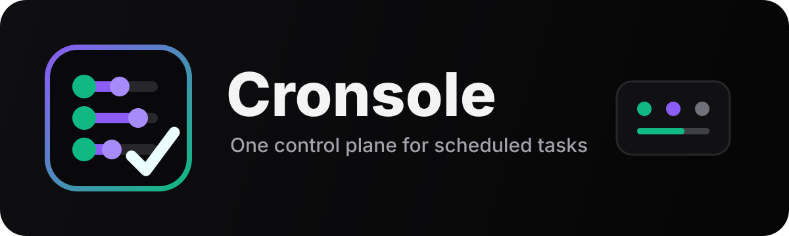

<a id="readme-top"></a>

<p align="center">
  <a href="docs/README.md">
    
  </a>
</p>

<p align="center">
  <em>The ultimate unified dashboard to view, trigger, and manage every scheduled job you own —<br>Windows Task Scheduler, AI assistants, and cron, all in one place.</em>
</p>

<p align="center">
  <a href="docs/README.md"><strong>Explore the docs »</strong></a>
</p>

<p align="center">
  <a href="https://cronsole.mikesailab.com/">🌐 Website &amp; Template Gallery</a>
  ·
  <a href="docs/ROADMAP.md">🗺️ Roadmap</a>
</p>

<p align="center">
  <a href="https://github.com/ai-automation-tools/cronsole/issues">Report Bug</a>
  ·
  <a href="https://github.com/ai-automation-tools/cronsole/issues">Request Feature</a>
</p>

<p align="center">
  <a href="https://cronsole.mikesailab.com/"></a>
  
  <a href="docs/ROADMAP.md"></a>
  <a href="LICENSE"></a>
</p>


<p align="center">
  
  
  
  
  
  
</p>

---


## 💡 What it does

Your scheduled jobs are scattered across Windows Task Scheduler, AI assistant routines, GitHub
Actions, and cron lines you half remember writing. Cronsole pulls them all into one dashboard —
see every job, run it, pause it, edit its schedule — without moving a single one off the
platform it already runs on.

## 🔌 What it connects to

| Platform | How it connects | Status |
|:---|:---|:---|
| **🪟 Windows Task Scheduler** | A lightweight local agent on your machine — outbound-only, never accepts incoming connections. | ✅ Functional |
| **⚡ Cronsole-native** | Four kinds of job that Cronsole schedules and runs itself, with no OS task involved: **HTTP** calls, an **existing program**, a **script you write in Cronsole**, and **checks** that assert something is true. | ✅ Functional |
| **🤖 Claude Code Routines** | Natural-language routines through the Anthropic API. With a readable Claude Code session Cronsole lists, creates, reschedules, pauses and fires them; without one it can fire the routines you declared. **Deleting always happens in claude.ai** — no API exposes it. | 🧪 Experimental |
| **✨ Gemini API Triggers** | Scheduled prompts on Google's managed agents. One API key, and Cronsole can run, pause, reschedule, create and delete them — plus read how their runs actually went. | 🧪 Experimental |
| **🌿 GitHub Actions** | Scheduled workflows in the repositories you watch, read through a PAT. **Read-only by design** — Cronsole shows their crons and real run outcomes, and changes nothing. | 👁️ Observer |
| **▲ Vercel Cron** | Cron jobs declared by the projects you watch. **Read-only by design**, and Vercel publishes no run history, so their health stays honestly unknown. | 👁️ Observer |
| **💬 ChatGPT · Grok · Jules · Open Claw · Hermes** | Quick links straight to their native scheduling screens — none of them exposes a public scheduled-task API to build on. Add your own, too. | 🔗 Quick links |

## 🎨 Screenshots

<details open>
<summary><b>📸 Dashboard, Templates, Settings, Views, and Themes</b> </summary>

<br>

<p align="center">
  
</p>

| | |
|:---:|:---:|
| <br><sub><b>Template library</b> — parameterized script starters</sub> | <br><sub><b>Apply Template</b> — fill in the blanks, get a real task</sub> |
| <br><sub><b>Task detail</b> — metadata, run history, Run Now</sub> | <br><sub><b>New Task</b> — Cronsole-native or Windows, with cron presets</sub> |
| <br><sub><b>List view</b> — sortable columns and quick actions</sub> | <br><sub><b>Kanban view</b> — tasks grouped by status</sub> |
| <br><sub><b>Schedule view</b> — chronological by next run</sub> | <br><sub><b>Light theme</b> — the same dashboard, light variant</sub> |

</details>

## ⚡ Quick Start

> [!TIP]
> The fastest path is Docker Compose — it brings up the database, backend, and frontend
> together. The Windows agent runs directly on your machine (see step 3).

1. Clone the repo:

   ```bash
   git clone https://github.com/ai-automation-tools/cronsole.git
   cd cronsole
   ```

2. Bring up the dev stack (Postgres + Redis + backend + frontend):

   ```bash
   docker compose --profile docker up --build
   #   → frontend  http://localhost:7373
   #   → backend   http://localhost:3000   (GET /api/health to verify)
   ```

   Database migrations apply themselves on boot, so there is no schema step. *(Verified
   2026-09-11 from a clean clone on a machine that had never run Cronsole — which is the only
   way this can be checked, and how [#90](docs/troubleshooting/README.md#90-a-fresh-clones-docker-quick-start-dies-with-the-table-publicuser-does-not-exist)
   was found.)*

   > [!IMPORTANT]
   > The `--profile docker` is not optional. Backend and frontend are opt-in profiles, so a
   > plain `docker compose up` starts **Postgres and Redis only** and nothing answers on
   > `:7373`. Omit the profile when you want to run the backend and frontend as host
   > processes instead (the manual path below).

3. Start the Windows agent so your real Task Scheduler tasks appear (PowerShell **as Administrator**; must run on the Windows host, not in Docker):

   ```powershell
   cd agent
   Set-ExecutionPolicy Bypass -Scope Process -Force; .\setup-agent-startup.ps1
   ```

4. Open [localhost:7373](http://localhost:7373). The first load asks you to create the owner account — that is the only account-creation path there is, and it works once. After that, the **Windows Agent** status in the sidebar should read **Online** with your tasks imported.

<details>
<summary><b>Prefer to run each piece manually (no Docker)?</b></summary>

<br>

```bash
# Backend — needs a PostgreSQL 16 instance
cd backend
cp .env.example .env        # then set DATABASE_URL + secrets (JWT_SECRET,
                            # ENCRYPTION_KEY, AGENT_PAIRING_SECRET) — the backend
                            # fail-fasts without them; see docs/setup/README.md
npm install
npm start                   # http://localhost:3000 — `prestart` migrates first

# Frontend — in a second terminal
cd frontend
cp .env.example .env.local  # set VITE_DEV_TOKEN so the dashboard can reach the backend
npm install
npm run dev                 # http://localhost:7373

# Windows agent — in a third terminal (Windows only)
cd agent/Cronsole.Agent
dotnet run                  # connects out to the backend, pushes Task Scheduler tasks
```

See [Setup & configuration](docs/setup/README.md) for every option.

</details>

<p align="right">(<a href="#readme-top">back to top</a>)</p>

## 🧱 Built With

| Layer | Technology |
|:---|:---|
| **Frontend** | React 19 + TypeScript + Vite + Tailwind CSS + TanStack Query + React Router |
| **Backend** | Node.js + Express 5 + Socket.io (TypeScript) |
| **Database** | PostgreSQL 16 + Prisma 6 ORM |
| **Windows agent** | .NET 10 (`Cronsole.Agent`) reading Windows Task Scheduler |
| **Hosting** | Runs locally — backend + agent on your machine; dev stack via Docker Compose |

## 📖 Documentation

Full documentation lives in **[`docs/`](docs/README.md)**. The main sections:

| Section | What's inside |
|:---|:---|
| [**📚 Documentation home**](docs/README.md) | The map to every guide, reference, and design doc. |
| [**📊 Features**](docs/FEATURES.md) | Everything Cronsole does today, and what each feature actually gives you. |
| [**📍 Status**](docs/STATUS.md) | What's supported on which platform, what's pre-1.0, and what isn't built yet. |
| [**⬇️ Installation**](docs/install/README.md) | Install Cronsole on Windows or macOS, or clone the repo. |
| [**⚙️ Setup & Configuration**](docs/setup/README.md) | Environment variables, Docker vs. manual, agent pairing. |
| [**🖥️ User Guides**](docs/user-guides/README.md) | Day-to-day guides for using Cronsole once it's running. |
| [**💬 Prompt Library**](docs/prompts/README.md) | Copy-paste prompts for driving Cronsole in plain English — scheduled scripts, headless coding-agent runs, HTTP jobs, audits. |
| [**🧯 Troubleshooting**](docs/troubleshooting/README.md) | Symptom → cause → fix for problems we've actually hit. |
| [**🧪 Testing**](docs/testing/README.md) | What to test and how to run it — functional, integration, regression, and UAT, plus step-by-step manual runbooks. |
| [**🗺️ Roadmap**](docs/ROADMAP.md) | What's shipped and what's next, in priority order. |

And the key guides, one click away:

| Guide | Takes you through |
|:---|:---|
| [**📦 Clone the Repo**](docs/install/guides/Clone_Repo_Guide.md) | The first step for every install path, plus common prerequisites. |
| [**🪟 Windows Install**](docs/install/guides/Windows_Install_Guide.md) | The full experience — stack, agent, and auto-start at logon. |
| [**🍎 macOS Install**](docs/install/guides/macOS_Install_Guide.md) | Dashboard + backend on macOS (no Windows agent yet). |
| [**🖥️ UI User Guide**](docs/user-guides/guides/UI_User_Guide.md) | Navigating the dashboard, categorizing tasks, applying templates. |
| [**🤖 Windows Agent Setup**](docs/user-guides/guides/Agent_Setup_Guide.md) | Installing, verifying, and troubleshooting the local agent. |
| [**🧩 MCP Server**](docs/user-guides/guides/MCP_Server_Guide.md) | Wiring Cronsole into Claude / Codex / Cursor to manage tasks in natural language. |
| [**🌐 Remote Access**](docs/user-guides/guides/Remote_Access_Guide.md) <sub>· optional</sub> | Reaching your own instance from your phone — one HTTPS origin behind Tailscale or a Cloudflare Tunnel, with nothing on the public internet. |
| [**💬 Prompts to start with**](docs/prompts/mcp-server/README.md) | What to actually say once the MCP server is connected, grouped by what you're trying to do. |
| [**🔥 Smoke Test**](docs/testing/manual-testing/runbooks/Smoke_Test.md) | Verifying your stack is actually alive and the agent is talking — in about 10 minutes. |

## 🧠 The Cronsole Skill

Building Cronsole with an AI agent? The repo ships an **[Agent Skill](skills/README.md)** — a
briefing that gives Claude Code the project's mental model *before* it touches anything: the
architecture, the invariants that must never break (schedules are cron-UTC, `exec` is
never implicitly shelled, the registry is content-addressed), and the traps that quietly eat
an afternoon (a Dockerized backend that won't hot-reload; an agent that must be republished).

```powershell
# Windows — junctions, so no admin rights or Developer Mode needed
pwsh scripts/setup-skill-links.ps1
```

```bash
# macOS / Linux
./scripts/setup-skill-links.sh
```

Run **once per clone**, then restart your CLI — it activates automatically on Cronsole work.
The script links [`skills/cronsole/`](skills/cronsole/SKILL.md) into `.claude/skills/`, so the
agent reads the tracked source directly and **no second copy exists to drift**. The skill
routes to [`docs/`](docs/README.md) rather than restating it, for the same reason.

Two more Cronsole skills live in the org's skill library —
[**`agent-skills` › `Skills/Projects/cronsole/`**](https://github.com/ai-automation-tools/agent-skills/tree/main/Skills/Projects/cronsole).
They cover the other half: not how to work on Cronsole, but **how to design the jobs it
schedules** — the archetypes a Windows Task Scheduler job turns out to be, and the prompt contract
a scheduled agent routine needs. Install them over this clone with that repo's installer.

> [!NOTE]
> **Skill vs. MCP server** — easy to conflate. The [**skill**](skills/README.md) teaches an
> agent to *work on* Cronsole's codebase. The [**MCP server**](docs/user-guides/guides/MCP_Server_Guide.md)
> lets an agent *use* a running Cronsole — list, run, and create tasks in natural language.

## 🤝 Contributing

Cronsole is an MVP-stage project. If you're working on it, start with
[`CONTRIBUTING.md`](CONTRIBUTING.md) and [`CLAUDE.md`](CLAUDE.md), and track work on the
[Roadmap](docs/ROADMAP.md). Recent changes are logged in [`docs/CHANGELOG.md`](docs/CHANGELOG.md).

Before opening a PR, run the suites and — for anything touching the agent, real Task
Scheduler, or security — the relevant [manual runbook](docs/testing/manual-testing/README.md):

```bash
cd backend  && npm test && npm run test:integration
cd ../frontend && npm run lint && npm test
cd ../agent  && dotnet test
```

See [**🧪 Testing**](docs/testing/README.md) for what each layer covers and where the gaps are.

<p align="right">(<a href="#readme-top">back to top</a>)</p>

---

<p align="center">
  Part of the <a href="https://mikesailab.com">mikesailab.com</a> ecosystem ·
  <a href="docs/README.md">Documentation</a> ·
  <a href="docs/ROADMAP.md">Roadmap</a>
</p>

<p align="center">
  <sub>© 2026 Michael Schecht · Licensed under <a href="LICENSE">Apache-2.0</a> · Local-first, pre-public MVP</sub>
</p>
