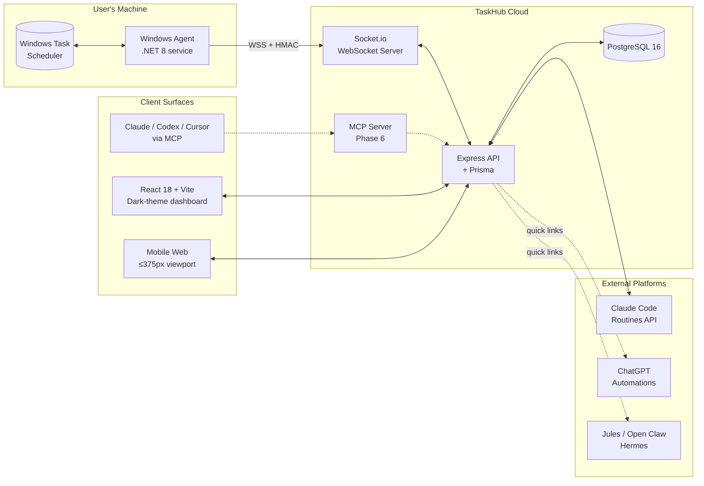

<h1 align="center">TaskHub</h1>

<p align="center">
  <em>One pane of glass for every scheduled task you own — Windows, AI assistants, and cron alike.</em>
</p>

<p align="center">
  
  
  
</p>

<p align="center">
  
  
  
  
  
  
  
  
</p>

---

> [!NOTE]
> **TaskHub is in Phase 0 — Inception & Discovery.** This repository currently contains planning documents only; no application source has been written yet. The roadmap, architecture, and competitive positioning are tracked in [`docs/`](docs/). MVP development begins in Phase 3.

---

## Overview

**TaskHub** is a unified scheduled-task management system. It gives a single dark-themed dashboard for viewing, triggering, and managing scheduled tasks that today live in disconnected silos:

- **Windows Task Scheduler** — via a lightweight local agent
- **Claude Code Routines** — via the Anthropic API
- **ChatGPT Automations** — via quick links to the native UI
- **Jules**, **Open Claw**, **Hermes**, and future systems

Beyond unification, TaskHub includes cross-platform schedule conversion templates (cron ↔ Windows trigger ↔ Claude routine YAML) and an **MCP server** (Phase 6) so Claude / Codex / Cursor can create and run scheduled tasks via natural language.

## Why this exists

No incumbent unifies AI-assistant schedulers with OS-level schedulers. Desktop tools (VisualCron, Task Till Dawn) are Windows-only or stagnant. Web orchestrators (Airflow, n8n, Rundeck, Jenkins) target data engineers and DevOps — the wrong persona for someone who just wants to *manage* the schedules across the tools they already use. Full survey: [`docs/Competition_Analysis.md`](docs/Competition_Analysis.md).

TaskHub's wedge:

1. **Cross-domain unification.** AI assistants + Windows + cron in one console.
2. **Mobile-first triggering.** Phone-trigger any Windows task in under 30 seconds.
3. **MCP-native.** First-class natural-language task creation, not a bolted-on chatbot.

## Architecture



The agent always initiates the WebSocket (outbound from the user's machine — never an inbound bind). Schedules are stored as **5-field cron in UTC** and translated to/from each platform's native format inside a `PlatformConnector` interface.

## Features (planned)

| Feature | Phase | Description |
|:---|:---:|:---|
| **Unified task list** | 3 | Single dashboard for tasks across all connected platforms. |
| **Manual run trigger** | 3 | Trigger Windows tasks remotely via the agent; trigger Claude routines via API. |
| **Quick links** | 3 | One-tap deep links to each platform's native management UI. |
| **Schedule conversion templates** | 3 | 5–10 cross-platform templates (cron ↔ Windows XML ↔ Claude YAML). |
| **Dark theme + mobile responsive** | 3 | Dark-by-default; passes `<375px` viewport for every page. |
| **Real-time sync** | 3 | WebSocket-driven task list updates; no polling on the client. |
| **Run history & logs** | 3–4 | Per-task execution log aggregated from every platform. |
| **MCP integration** | 6 | Natural-language `list_tasks`, `run_task`, `create_task`, `convert_schedule`. |
| **Two-way sync** | 6 | Edit a schedule in TaskHub → propagate to the platform. |
| **Public template gallery** | 6 | Community-contributed schedule templates with voting. |

## MVP Scope

<table>
<tr>
<td width="50%" valign="top">

### In scope (MVP, ~6 months)

- Windows Task Scheduler (local agent)
- Claude Code Routines (API)
- Unified task list view
- Quick links to each platform's native UI
- Manual run trigger
- Static template library
- Dark theme, mobile responsive

</td>
<td width="50%" valign="top">

### Out of scope (post-MVP)

- Full two-way sync
- Cross-platform dependency chains
- MCP-driven AI task creation *(Phase 6)*
- Open Claw, Hermes, Jules connectors
- ChatGPT Automations API *(no public API exists)*
- Mobile native apps *(web-responsive only)*

</td>
</tr>
</table>

## Tech Stack

| Layer | Technology |
|:---|:---|
| **Frontend** | React 18 + TypeScript + Vite + Tailwind CSS + shadcn/ui |
| **Server state** | TanStack Query |
| **Backend API** | Node.js (LTS) + Express + TypeScript |
| **Database** | PostgreSQL 16 + Prisma ORM |
| **Real-time** | Socket.io (server) + WebSocket client (agent) |
| **Windows agent** | .NET 8 (C#) + `Microsoft.Win32.TaskScheduler` + WiX installer |
| **Auth** | JWT (access + refresh); OAuth2 post-MVP |
| **Cache / pub-sub** | Redis (optional MVP; required for multi-instance WS) |
| **MCP server** | Node.js wrapper over REST API *(Phase 6)* |
| **Dev hosting** | Docker Compose |
| **Prod hosting** | AWS ECS Fargate or Render; static frontend on S3 + CloudFront or Vercel |

All base images are pinned; no `:latest`.

## Roadmap

| Phase | Doc | Duration | Status |
|:---:|:---|:---:|:---|
| 0 — Inception & Discovery | [`Phase0.md`](docs/Phase0.md) | 1–2 wk | **Active** |
| 1 — Requirements & Specs | [`Phase1.md`](docs/Phase1.md) | 2–3 wk | Drafted |
| 2 — Architecture & Design | [`Phase2.md`](docs/Phase2.md) | 2 wk | Drafted |
| 3 — Development (MVP) | [`Phase3.md`](docs/Phase3.md) | 8–12 wk | Not started |
| 4 — Testing & QA | [`Phase4.md`](docs/Phase4.md) | 2–3 wk | Not started |
| 5 — Deployment & Rollout | [`Phase5.md`](docs/Phase5.md) | 1–2 wk | Not started |
| 6 — Post-Launch & Iteration | [`Phase6.md`](docs/Phase6.md) | ongoing | Not started |

Master plan and timeline live in [`docs/Project_Plan.md`](docs/Project_Plan.md).

## Repository Structure

```
taskhub/
├── CLAUDE.md                  # Project-scoped Claude Code instructions
├── README.md                  # ← you are here
├── docs/                      # Planning, architecture, and reference docs
│   ├── Project_Plan.md        # Master overview + timeline
│   ├── Phase0.md … Phase6.md  # Per-phase deep dives
│   ├── Competition_Analysis.md
│   └── api-examples/          # Sample REST request/response payloads
├── backend/                   # Node.js + Express + Prisma   (created in Phase 3)
├── frontend/                  # React 18 + Vite              (created in Phase 3)
├── agent/                     # .NET 8 Windows service       (created in Phase 3)
├── mcp-server/                # Node.js MCP wrapper          (created in Phase 6)
├── src/templates/             # Starter scaffolds / inspiration archives
└── images/                    # README + docs assets
```

> [!TIP]
> The `backend/`, `frontend/`, `agent/`, and `mcp-server/` folders are created **when their sprint starts** — not up front. This keeps the repo honest about what's actually in flight.

## Documentation

| Doc | What's in it |
|:---|:---|
| [`docs/Project_Plan.md`](docs/Project_Plan.md) | Master plan: phases, timeline, risk matrix, next actions. |
| [`docs/Phase0.md`](docs/Phase0.md) | Project charter, risk register, tech stack, MVP roadmap, feasibility checks. |
| [`docs/Phase1.md`](docs/Phase1.md) | Functional + non-functional requirements, user stories, API contracts. |
| [`docs/Phase2.md`](docs/Phase2.md) | System architecture, security design, ER diagram, UI mockups. |
| [`docs/Phase3.md`](docs/Phase3.md) | Eight-sprint MVP build plan. |
| [`docs/Phase4.md`](docs/Phase4.md) | Test plan, security audit, performance targets. |
| [`docs/Phase5.md`](docs/Phase5.md) | Deployment, rollout, monitoring. |
| [`docs/Phase6.md`](docs/Phase6.md) | Post-launch iteration, MCP integration, advanced features. |
| [`docs/Competition_Analysis.md`](docs/Competition_Analysis.md) | Competitive landscape and positioning. |
| [`docs/api-examples/`](docs/api-examples/) | Sample REST payloads for tasks, platforms, templates. |
| [`CLAUDE.md`](CLAUDE.md) | Project-scoped Claude Code instructions, conventions, and tooling. |

## Getting Started

> [!IMPORTANT]
> There is no runnable code yet. The instructions below are placeholders that will be filled in during Phase 3 (Sprint 1).

```bash
# Phase 3 — coming soon
git clone https://github.com/michaelschecht/taskhub.git
cd taskhub
docker compose up        # backend + Postgres + frontend dev
# Windows agent installer published in Phase 5
```

In the meantime, the right entry points are:

1. **Read [`CLAUDE.md`](CLAUDE.md)** — the source of truth for project conventions, the connector pattern, the agent ↔ server protocol, and security rules.
2. **Read [`docs/Project_Plan.md`](docs/Project_Plan.md)** — the master plan and phase index.
3. **Browse [`docs/Phase0.md`](docs/Phase0.md)** — the active phase doc.

## Domain Conventions

A few non-obvious rules that the project lives by (full list in [`CLAUDE.md`](CLAUDE.md) §9):

- **All schedules stored as 5-field cron in UTC.** Conversion to/from native formats happens in the connector layer; the UI shows local time.
- **`PlatformConnection.config` is AES-256-GCM encrypted** at the application layer before Prisma writes. Decrypted values are never logged.
- **Agent always initiates the WebSocket.** Never inbound. Never a `0.0.0.0` bind. Run commands carry a per-session HMAC to prevent replay.
- **Dark theme is the default,** not an opt-in. Light is the toggle.
- **Every page must pass `<375px` viewport.** Mobile is a first-class target — the core KPI is "trigger a Windows task from your phone in under 30 seconds."

## Working Branches

| Branch | Purpose |
|:---|:---|
| `mike_desktop` | Active working branch (matches Mike's workspace convention). |
| `main` | Deploy branch. Updated only when shipping. |

Commit style: imperative subject + conventional-commits prefix (`feat:`, `fix:`, `chore:`, `docs:`, `refactor:`, `test:`).

---

<p align="center">
  Part of the <a href="https://mikesailab.com">mikesailab.com</a> ecosystem ·
  <a href="docs/Project_Plan.md">Project Plan</a> ·
  <a href="docs/Phase0.md">Active Phase</a> ·
  <a href="CLAUDE.md">Claude Instructions</a>
</p>

<p align="center">
  <sub>© 2026 Michael Schecht · Private repository · All rights reserved</sub>
</p>
