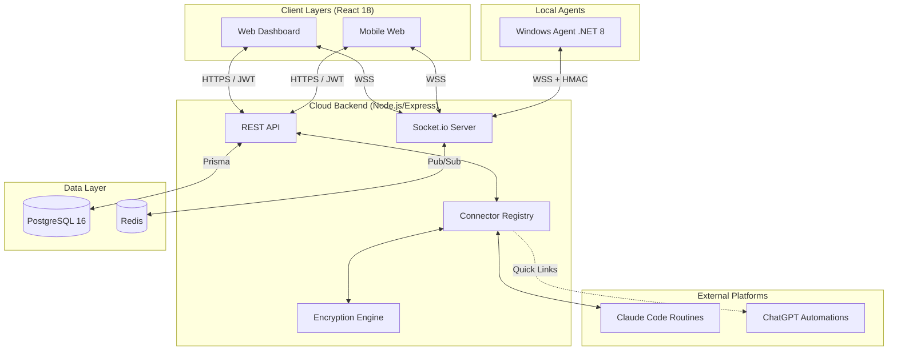

# Phase 2: Architecture & Design

**Duration:** 2 weeks
**Status:** **Active**
**Master plan:** [`Project_Plan.md`](Project_Plan.md)
**Predecessor:** [`Phase1.md`](Phase1.md)
**Informed by:** [`Business_Idea_Assessment.md`](Business_Idea_Assessment.md)

---

> **Design priorities (per the assessment).** Reliability is the product. The architecture makes the connector layer a **hard abstraction boundary** with **version pinning** and **fast fallback to quick-links** when an upstream API drifts. It surfaces **connector health diagnostics** as first-class data and treats the local agent as an **auditable, least-privilege** component.

## Deliverable 1: System Architecture Diagram

### Strategic Abstraction: The Connector Registry
The `ConnectorRegistry` ensures that the API and UI layers never touch platform-specific code. Each platform (Windows, Claude) implements a `PlatformConnector` interface. If an API breaks, the connector flips to `DEGRADED` status, and the UI automatically fallbacks to showing native deep links.

---

## Deliverable 2: Security Design

### 2.1 Agent Handshake & Trust
- **Outbound Only**: The agent initiates the connection to `wss://api.taskhub.app`.
- **HMAC Signing**: Commands sent to the agent (e.g., `task:run`) are signed with a per-session secret to prevent replay attacks.
- **Least Privilege**: The .NET agent is designed to run under a restricted service account, not `SYSTEM`.

### 2.2 Application-Level Encryption
- **AES-256-GCM**: Sensitive data in `PlatformConnection.config` (API keys, pairing secrets) is encrypted by the Node.js backend *before* reaching the database.
- **Key Rotation**: The encryption key is managed via environment variables and can be rotated without affecting the database schema.

---

## Deliverable 3: Database Schema (Prisma)

The finalized schema in `backend/prisma/schema.prisma` anchors the "control plane" vision:

- **`PlatformConnection`**: Stores encrypted config + real-time health diagnostics (`HealthState`).
- **`Task`**: Normalized 5-field cron (UTC). `externalId` maps to native platform IDs.
- **`ExecutionLog`**: Rich logs for every trigger event, linking back to `Task`.
- **`Template`**: Cross-platform conversion base.

### Performance Indexes
- `idx_tasks_next_run`: Optimized for the "What runs next?" dashboard widget.
- `idx_execution_logs_desc`: Optimized for the "Last 5 runs" task history view.

---

## Deliverable 4: WebSocket Protocol (Socket.io 4.x)

| Message Type | Direction | Payload |
|:---|:---|:---|
| `agent:hello` | Agent -> Server | Machine name, OS version, Agent version |
| `task:list` | Server -> Agent | (Empty request) |
| `task:full_list` | Agent -> Server | Array of normalized task objects |
| `task:run` | Server -> Agent | `externalId`, `commandId` |
| `task:executed` | Agent -> Server | `success`, `output`, `platformRunId` |

---

## Deliverable 5: Deployment Strategy

- **Development**: Docker Compose (Postgres + Redis + Backend + Frontend).
- **Production**: 
    - **Frontend**: Vercel/S3 (Static).
    - **Backend**: AWS ECS Fargate or Render.
    - **Database**: Managed PostgreSQL 16.

---

## Phase 2 Exit Criteria

- [x] System architecture diagram finalized (Mermaid).
- [x] Security design reviewed (Encryption + Agent Trust).
- [x] Prisma schema initialized in `backend/prisma/schema.prisma`.
- [ ] Docker Compose environment booting all 3 tiers.

→ Advance to **[Phase 3: Development (MVP)](Phase3.md)**.
