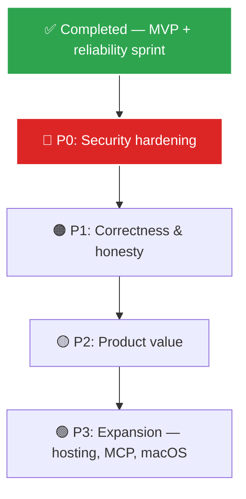

# TaskHub Documentation Index

  
  
  

Welcome to the **TaskHub** documentation repository. This directory houses the specifications, lifecycle phases, templates, and research backing the Unified Scheduled Task Management system.

---

## 🗺️ Documentation Directory Layout

*   📄 [ROADMAP.md](./ROADMAP.md) — **The living plan**: completed work + prioritized open items (P0–P3)
*   📂 [archive/](./archive/) — Historical planning docs from the MVP build (frozen)
    *   📄 [Project_Plan.md](./archive/Project_Plan.md) — Original master overview & timeline
    *   📂 [phases/](./archive/phases/) — Phase 0–6 lifecycle deep-dives
*   📂 [research/](./research/) — Business assessments & competition audits
    *   📄 [Business_Idea_Assessment.md](./research/Business_Idea_Assessment.md) — Market viability analysis
    *   📄 [Competition_Analysis.md](./research/Competition_Analysis.md) — Competitive landscape audit
    *   📄 [Product_Desirability_Analysis.md](./research/Product_Desirability_Analysis.md) — Desirability roadmap & UX enhancements
*   📂 [specs/](./specs/) — Engineering contracts and test definitions
    *   📄 [CONTRACTS.md](./specs/CONTRACTS.md) — API request/response specs
    *   📄 [Test_Plan.md](./specs/Test_Plan.md) — Quality assurance test scenarios
*   📂 [api-examples/](./api-examples/) — Raw JSON request/response payloads
*   📂 [resources/](./resources/) — Dynamic schemas and catalog templates
    *   📄 [Templates.md](./resources/Templates.md) — Script template catalog spec
*   📂 [user-guides/](./user-guides/) — User onboarding and platform walkthroughs

---

## 🏗️ How Planning Works Now

The phase lifecycle (0–6) that guided the MVP build is **complete and archived**. Planning runs through a single living document:

See **[ROADMAP.md](./ROADMAP.md)** for the full item list, open decisions, and strategy guardrails.

---

## 📖 Subdirectory Details

### 📂 [archive/](./archive/) — Historical Planning (frozen)
The blueprint documentation from the MVP build, kept for reference — the original [Project_Plan.md](./archive/Project_Plan.md) and per-phase deep-dives ([Phase 0](./archive/phases/Phase0.md) inception → [Phase 6](./archive/phases/Phase6.md) post-launch/MCP plans). Don't update these; new work goes on the [roadmap](./ROADMAP.md).

### 🔍 [research/](./research/) — Strategy & Audits
Investigates viability, competition, and product positioning:
*   [Business Assessment](./research/Business_Idea_Assessment.md): Evaluates control-plane market placement, SaaS monetization models, and MVP constraints.
*   [Competition Analysis](./research/Competition_Analysis.md): Side-by-side audit of commercial schedulers (n8n, Zapier, Cronicle) highlighting TaskHub's niche in local agent reliability.
*   [Product Desirability](./research/Product_Desirability_Analysis.md): Recommendations on live terminal log streaming, dead-man's watchdogs, Go/Rust agent compilation, and environment secrets management.

### 📋 [specs/](./specs/) — Technical Specifications
Outlines system contracts and quality validation rules:
*   [API Contracts](./specs/CONTRACTS.md): Comprehensive request/response JSON schemas for tasks, templates, and executions.
*   [Test Plan](./specs/Test_Plan.md): Step-by-step verification flows for local agent WebSocket persistence, template parsing, and React component coverage.

---

  Built with React & Node.js · <a href="./ROADMAP.md">Roadmap</a> · <a href="../README.md">Repository Root</a>

