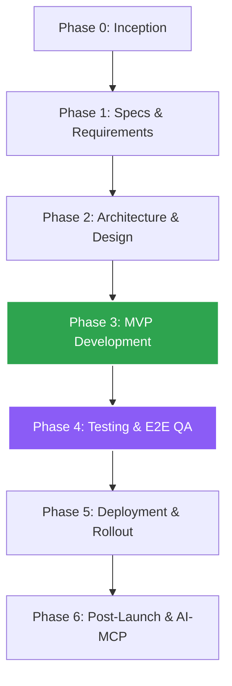

# TaskHub Documentation Index

  
  
  

Welcome to the **TaskHub** documentation repository. This directory houses the specifications, lifecycle phases, templates, and research backing the Unified Scheduled Task Management system.

---

## 🗺️ Documentation Directory Layout

*   📄 [Project_Plan.md](./Project_Plan.md) — Master overview & timeline index
*   📂 [phases/](./phases/) — Project lifecycle phase documents
    *   📄 [Phase0.md](./phases/Phase0.md) — Inception & Discovery
    *   📄 [Phase1.md](./phases/Phase1.md) — Requirements & Specifications
    *   📄 [Phase2.md](./phases/Phase2.md) — Architecture & Design
    *   📄 [Phase3.md](./phases/Phase3.md) — Development (MVP)
    *   📄 [Phase4.md](./phases/Phase4.md) — Testing & QA
    *   📄 [Phase5.md](./phases/Phase5.md) — Deployment & Rollout
    *   📄 [Phase6.md](./phases/Phase6.md) — Post-Launch & Iteration
*   📂 [research/](./research/) — Business assessments & competition audits
    *   📄 [Business_Idea_Assessment.md](./research/Business_Idea_Assessment.md) — Market viability analysis
    *   📄 [Competition_Analysis.md](./research/Competition_Analysis.md) — Competitive landscape audit
    *   📄 [Product_Desirability_Analysis.md](./research/Product_Desirability_Analysis.md) — Desirability roadmap & UX enhancements
*   📂 [specs/](./specs/) — Engineering contracts and test definitions
    *   📄 [CONTRACTS.md](./specs/CONTRACTS.md) — API request/response specs
    *   📄 [Test_Plan.md](./specs/Test_Plan.md) — Quality assurance test scenarios
*   📂 [api-examples/](./api-examples/) — Raw JSON request/response payloads
*   📂 [resources/](./resources/) — Dynamic schemas and catalog templates
    *   📄 [Templates.md](./resources/Templates.md) — Script template catalog spec
*   📂 [user-guides/](./user-guides/) — User onboarding and platform walkthroughs

---

## 🏗️ Project Lifecycle Flow

---

## 📖 Subdirectory Details

### 📂 [phases/](./phases/) — Lifecycle Stages
Contains the blueprint documentation for each phase of the project:
*   [Phase 0: Inception](./phases/Phase0.md): Discovery, initial risk assessment, and core feasibility checks.
*   [Phase 1: Specs](./phases/Phase1.md): Functional and non-functional requirements.
*   [Phase 2: Architecture](./phases/Phase2.md): System diagrams, database schemas, and local Windows Agent WebSocket design.
*   [Phase 3: Development](./phases/Phase3.md): Agile sprint breakdown (Sprints 1–10) covering database setup, agent websocket handshakes, templates, and dashboard modules.
*   [Phase 4: Testing](./phases/Phase4.md): Staging setups, test suites execution, and reliability criteria.
*   [Phase 5: Rollout](./phases/Phase5.md): Hosting guides, binary signing, and installer updates.
*   [Phase 6: Iteration](./phases/Phase6.md): Future expansion plans for Model Context Protocol (MCP) integrations.

### 🔍 [research/](./research/) — Strategy & Audits
Investigates viability, competition, and product positioning:
*   [Business Assessment](./research/Business_Idea_Assessment.md): Evaluates control-plane market placement, SaaS monetization models, and MVP constraints.
*   [Competition Analysis](./research/Competition_Analysis.md): Side-by-side audit of commercial schedulers (n8n, Zapier, Cronicle) highlighting TaskHub's niche in local agent reliability.
*   [Product Desirability](./research/Product_Desirability_Analysis.md): Recommendations on live terminal log streaming, dead-man's watchdogs, Go/Rust agent compilation, and environment secrets management.

### 📋 [specs/](./specs/) — Technical Specifications
Outlines system contracts and quality validation rules:
*   [API Contracts](./specs/CONTRACTS.md): Comprehensive request/response JSON schemas for tasks, templates, and executions.
*   [Test Plan](./specs/Test_Plan.md): Step-by-step verification flows for local agent WebSocket persistence, template parsing, and React component coverage.

---

  Built with React & Node.js · <a href="./Project_Plan.md">Master Plan</a> · <a href="../README.md">Repository Root</a>

