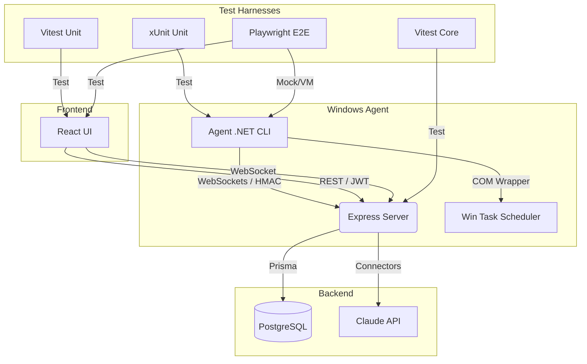
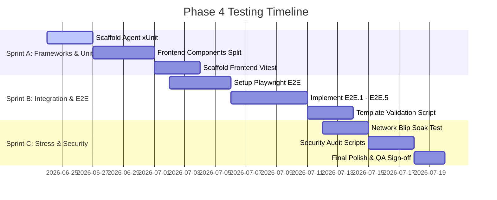

# TaskHub Test Plan — Phase 4 (Testing & QA)

This document defines the comprehensive test plan for the TaskHub Scheduled Task Management System. It maps the current test coverage baseline, details the strategy for missing test suites, and establishes the testing protocols to validate the reliability, security, and performance KPIs required for release.

---

## 1. Objectives & Quality Gates

TaskHub is a **reliability control plane**. Therefore, testing is centered around ensuring that the state shown to the user is 100% trustworthy, that actions execute with high confidence, and that connection drops degrade gracefully.

### Key Quality Gates (Release Blockers)
*   **Sync Reliability:** $\ge 95\%$ of scans correctly reflect the true state of source platforms.
*   **Onboarding Efficiency (NFR10):** A fresh user must be able to connect two platforms (Windows agent + Claude) in $< 15$ minutes.
*   **Performance (NFR1):** Dashboard initial load $< 2$ seconds on Fast 3G.
*   **Agent Reconnection:** Agent must reconnect within 30 seconds after backend recovery.
*   **Honest Confidence Scores:** No lossy schedule conversions applied without user consent.

---

## 2. Current Test Coverage Baseline

The backend already has a highly robust test suite. The frontend and agent currently lack automated tests.

### Coverage Summary

| Area | Component | Testing Framework | Coverage (Lines) | Status | Notes |
|---|---|---|---|---|---|
| **Backend** | Services & Core | Vitest | **97.50%** | **Green** | Direct DB operations and mock websockets tested. |
| **Backend** | Auth / Encryption | Vitest | **95.83%** | **Green** | AES-256-GCM encryption roundtrips. |
| **Backend** | Connectors Layer | Vitest | **97.40%** | **Green** | Claude & Windows Agent connectors mocked and tested. |
| **Frontend** | UI / Components | N/A | **0%** | **Pending** | Single-file UI (`Dashboard.tsx`); needs unit tests. |
| **Agent** | .NET 8 CLI Agent | N/A | **0%** | **Pending** | Needs xUnit wrapper mock for Task Scheduler. |
| **E2E** | Full System | N/A | **0%** | **Pending** | Needs Playwright setup. |

### Vitest Coverage Report (Current)

```text
File               | % Stmts | % Branch | % Funcs | % Lines | Uncovered Line #s 
-------------------|---------|----------|---------|---------|-------------------
All files          |   97.61 |    84.48 |     100 |    97.5 |                   
 auth              |   95.83 |    88.88 |     100 |   95.83 |                   
  encryption.ts    |   95.83 |    88.88 |     100 |   95.83 | 10                
 connectors        |   97.56 |     87.8 |     100 |    97.4 |                   
  ClaudeConnector  |     100 |    94.73 |     100 |     100 | 29                
  WindowsAgentConn |   96.49 |    81.81 |     100 |   96.36 | 49,92             
  registry.ts      |     100 |      100 |     100 |     100 |                   
 services          |     100 |     62.5 |     100 |     100 |                   
  TaskService.ts   |     100 |     62.5 |     100 |     100 | 28-48             
 ws                |     100 |      100 |     100 |     100 |                   
  AgentManager.ts  |     100 |      100 |     100 |     100 |                   
-------------------|---------|----------|---------|---------|-------------------
```

---

## 3. Detailed Test Strategy & Implementation Map



### 3.1. Unit Testing (Target: $\ge 80\%$ on all new business logic)

#### A. Frontend UI Unit Tests (`frontend/__tests__/`)
*   **Tooling:** `vitest` + `@testing-library/react` + `jsdom`.
*   **Target Components & Hooks:**
    *   `Dashboard` components: We will extract `TaskRow`, `TaskDetailModal`, and `PlatformStatusBar` into a `components/` directory.
    *   We will mock the `@tanstack/react-query` data layer to assert correct rendering of:
        *   Task list grid filter (tabs, search queries, active/disabled states).
        *   Manual sync, category update, and task run click handlers.
        *   The **Import Filter Modal** (verifying that `Microsoft` and `Uncategorized` categories are unchecked by default, but toggleable).

#### B. C# Agent Unit Tests (`agent/TaskHub.Agent.Tests/`)
*   **Tooling:** `xUnit` + `Moq` + `FluentAssertions`.
*   **Key Coverage Targets:**
    *   `TaskSchedulerWrapper`: Abstract the native `Microsoft.Win32.TaskScheduler` COM calls behind an `ITaskService` interface. Mock this interface to verify:
        *   Listing tasks mapping format.
        *   Triggering task by path.
        *   Creating task definition parsing (verifying parameters convert accurately into scheduled actions).
    *   `WebSocketClient`: Assert reconnection logic under simulated drops. Use a test scheduler to verify exponential backoff timing ($1\text{s} \to 2\text{s} \to 4\text{s} \to \dots \to 5\text{min}$ cap).

---

### 3.2. Integration Testing

*   **Database & API Scaffolding:** 
    *   Run integration tests against a real Postgres container (`docker-compose -f docker-compose.test.yml up`).
    *   Verify CRUD on `PlatformConnection` (including AES-256-GCM encryption roundtrip into the DB) and manual updates.
*   **WebSocket State Machine:**
    *   Test agent authentication lifecycle using pairing secrets.
    *   Assert transaction sequence:
        1.  Frontend clicks **Sync Now**.
        2.  Server sends `task:scan` request to agent socket.
        3.  Agent scans and replies with `agent:tasks:list`.
        4.  Server updates database records and pushes `tasks:updated` message to frontend client.
*   **HMAC Signature Protection:**
    *   Assert that run-trigger commands signed with dynamic HMAC keys are accepted, while commands missing signatures or using expired/replay signatures are rejected with `401 Unauthorized`.

---

### 3.3. End-to-End (E2E) Testing (Playwright)

*   **Setup:** Scaffold a `frontend/tests/e2e/` folder. Playwright will run against the built frontend and backend staging server.
*   **Test Script Specifications:**

| Test ID | Scenario | Verification Criteria |
|---|---|---|
| **E2E.1** | Onboarding Flow | User registers, logs in, adds a custom platforms link, and verifies navigation. |
| **E2E.2** | Agent Sync & Run | Mock agent connects $\to$ UI indicates online $\to$ User clicks "Run Now" $\to$ Toast notification shows success within 5 seconds. |
| **E2E.3** | Template Apply | User opens template catalog $\to$ chooses "Daily database backup" $\to$ parameters live preview updates $\to$ clicks apply $\to$ target mock agent receives payload. |
| **E2E.4** | Mobile Responsiveness | Force `<375px` viewport (Pixel 7) $\to$ verify responsive layout remains functional and action buttons are accessible. |
| **E2E.5** | Agent Offline Guard | Kill agent client socket $\to$ within 60 seconds, UI badge switches to "Offline" and "Run Now" is disabled. |
| **E2E.6** | Action Confirmation | Click "Run Now" or toggle a task $\to$ confirmation modal triggers $\to$ user cancels (stops execution) $\to$ user accepts (triggers execution). |
| **E2E.7** | Execution Fail logs | Run a task that returns a non-zero exit code $\to$ verification that toast shows red failure and task detail log appends the stderr traceback. |
| **E2E.8** | Diagnostic Health | Simulate invalid Claude API key $\to$ Platform health diagnostic lists "Key authentication failed" with corrective instructions. |
| **E2E.9** | Time-gated Pair | Onboarding stopwatch test: Ensure agent pairing and API key setup is completed in under 15 minutes. |

---

### 3.4. Conversion Template Validation

We will write a dedicated verification script `backend/src/utils/test-templates.ts` to assert conversion integrity across all 20 catalog templates:

1.  **Reversible Cron Equivalences:**
    *   Verify cron schedule parsing from `CronExpression` to `Windows Trigger` schedule configurations.
    *   Assert that a round-trip parsing (`cron` $\to$ `Windows Task` $\to$ `cron`) returns the identical expression.
2.  **Honest Confidence Scoring:**
    *   If a template includes parameters that require system-level changes (e.g., folder paths changing between OS environments), the confidence score must return $< 1.0$ and include at least one warning payload in the API response.
    *   If a conversion is highly lossy (confidence score $< 0.7$), E2E tests must verify that the web UI blocks automatic apply and requires user acknowledgment of potential incompatibilities.

---

### 3.5. Security Audit Protocol

The security review will verify the following checklist items:
*   **At-Rest Encryption:** Directly inspect the database tables (`PlatformConnection` table) to verify all API keys and config strings are stored as encrypted ciphertexts.
*   **Secrets Isolation:** Run a pre-commit scanner (e.g., `gitleaks`) to ensure no `.env` values or private keys have been committed.
*   **Brute-force Mitigation:** Write a test script requesting `/api/auth/login` 10 times in 10 seconds and verify that the server returns `429 Too Many Requests`.
*   **Replay Attack Prevention:** Verify that duplicate WebSocket run envelopes using expired HMAC timestamps are rejected.

---

## 4. Execution Roadmap

To efficiently complete Phase 4 Testing & QA, we will split the implementation into 3 main sprints:



### Next Immediate Action Items (Sprint A)
1.  **Refactor Frontend Layout:** Extract `TaskRow`, `TaskDetailModal`, and `PlatformStatusBar` out of [Dashboard.tsx](file:///D:/AI_Agents/Projects/Mikes_AI_Lab/Repos/Live_Apps/taskhub/frontend/src/Dashboard.tsx) into a components directory so they are importable for unit testing.
2.  **Set up the C# xUnit Test project:** Create a new project `TaskHub.Agent.Tests` in the C# solution and implement mocks for `Microsoft.Win32.TaskScheduler`.
3.  **Setup Vitest in Frontend:** Install `@testing-library/react` and configured `jsdom` runner.
